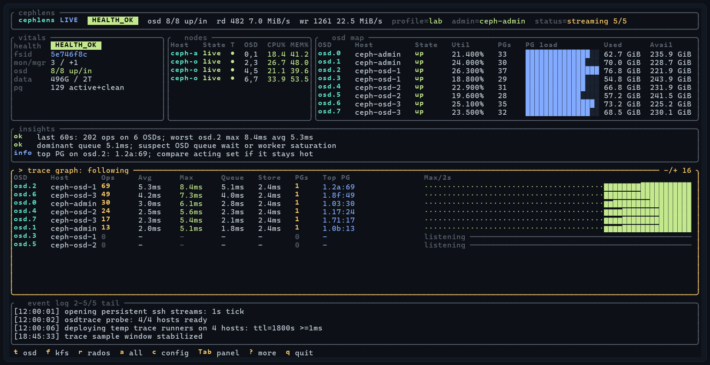

<p align="center">
  
</p>

<h1 align="center">CephLens</h1>

[](LICENSE)

[](https://github.com/xtrusia/cephlens/actions/workflows/ci.yml)

An SSH-driven Ceph investigation TUI with live cluster status, per-node
readiness, and osdtrace/kfstrace/radostrace eBPF latency views.

cephlens runs on Windows, Linux, or macOS and talks to Ceph nodes over
persistent SSH streams. It is currently a lab-first prototype, not a packaged
production monitoring agent.



Trace collection runs cephtrace tracers over SSH. `osdtrace` uses a temporary
remote runner script that removes itself when tracing stops or cephlens exits;
`kfstrace` and `radostrace` run directly on configured client hosts.

## Quick start

You need three things first. Non-interactive SSH to every Ceph host, passwordless `sudo -n` on those hosts, and the `ceph` and `rados` CLIs on the admin host. Details are in Requirements and in Access and sudo.

```sh
# install (Linux / macOS; see Install for Windows and source builds)
curl --proto '=https' --tlsv1.2 -LsSf https://cephlens.seyeong.kim/install.sh | sh
```

Run these commands from the directory where you want to keep the config and local session data.

```sh
cephlens init-config
$EDITOR cephlens.toml
cephlens doctor
cephlens tui
```

In a source clone, use `cargo run -- init-config`, edit the generated file, then run `cargo run -- doctor` and `cargo run -- tui`.

## Non-goals

- No standing monitoring. cephlens does not run a permanent daemon, keep long-term metrics, or send alerts. Use Prometheus, Grafana, or the Ceph dashboard for that.
- No cluster management. It observes the cluster. The only writes are the temporary `cephlens-test-*` benchmark pools created by `bench` and `lab`.
- Not reviewed for production use yet. See Status.

## Features

- Live cluster health, quorum, OSD counts, and IO throughput over a single SSH stream.
- Per-node readiness: connection state, OSD ids, CPU and memory percent, and Ceph version/deployment.
- osdtrace eBPF latency tracing with per-OSD and per-PG breakdown of queue, BlueStore, and KV-commit latency.
- No standing agent: no permanent daemon on the nodes; the osdtrace runner script removes itself on stop, quit, or TTL expiry. (The cephtrace tracer binaries you deploy do persist under `~/.cephlens/bin/`.)
- Edit hosts and trace settings live in the TUI; changes apply to open SSH streams immediately.
- Export recorded sessions as Markdown reports with the same diagnostic rules used by the TUI.

## Requirements

Controller (where the TUI runs):

- Rust 1.85+ (edition 2024) to build.
- An OpenSSH client on `PATH`, with every host reachable over non-interactive SSH (key-based, no password prompt). Windows 10/11 ship this as the optional OpenSSH Client feature; macOS and Linux include it by default.

Ceph nodes:

- `ceph` and `rados` CLIs, plus passwordless `sudo -n` for the observed commands (see Access and sudo).
- For tracing, the `osdtrace`, `kfstrace`, and `radostrace` binaries from [cephtrace](https://github.com/taodd/cephtrace). They are eBPF-based and need a Linux 5.8+ kernel on the Ceph hosts. A compatible kernel alone does not guarantee that a tracer supports the installed Ceph build. Check the compatibility result from `cephlens doctor` before capture.

## Supported platforms and trace limits

| Controller platform | Prebuilt release |
| --- | --- |
| Linux x86_64 | Yes |
| Windows x86_64 | Yes |
| macOS x86_64 | Yes |
| macOS ARM64 | Yes |
| Linux ARM64 | No |
| Windows ARM64 | No |

Release archives include Linux x86_64 cephtrace binaries. A source build does not include tracer binaries. Place compatible tracers under `~/.cephlens/bin/` or `PATH` on the remote hosts, or configure the pinned osdtrace install described below.

Automatic osdtrace installation is limited to x86_64 or amd64 hosts in the Debian or Ubuntu family. Actual trace support also depends on the Ceph version and the tracer compatibility reported by `cephlens doctor`. Some Ceph builds need separate matching DWARF data.

cephlens runs kfstrace with `-m mds`. Its kfstrace view covers CephFS MDS metadata operations. The upstream tracer's OSD and all modes are not exposed by cephlens.

## Install

Prebuilt binaries are attached to each [release](https://github.com/xtrusia/cephlens/releases). The archives include the Linux x86_64 cephtrace binaries for deployment to compatible remote hosts.

Install script (picks the right binary for your platform):

```sh
# Linux / macOS
curl --proto '=https' --tlsv1.2 -LsSf https://cephlens.seyeong.kim/install.sh | sh
```

```powershell
# Windows (PowerShell)
irm https://cephlens.seyeong.kim/install.ps1 | iex
```

Or download a `cephlens-<target>.tar.xz` / `.zip` archive and extract it. Each
archive holds the `cephlens` binary plus a `cephtrace/` directory with the
`osdtrace` / `kfstrace` / `radostrace` binaries; deploy those to your Ceph hosts
under `~/.cephlens/bin/` or `PATH`.

### From source

```sh
cargo install --git https://github.com/xtrusia/cephlens
# or, in a clone:
cargo build --release
```

A source build does not bundle cephtrace. Supply the tracers on the hosts as described in Requirements.

## Status

This project is suitable for lab clusters and experiments. Before using it on a
production cluster, review the sudo policy, osdtrace artifact source, and
cleanup behavior described below.

## Configuration

Create the config with the installed command, then edit it for your cluster.

```sh
cephlens init-config
$EDITOR cephlens.toml
```

If you cloned the source repository, `cp cephlens.example.toml cephlens.toml` is also available.

`cephlens.toml` defines the Ceph hosts to observe and is intentionally ignored by git because it may contain site-specific hostnames.

```toml
default_profile = "example"
session_keep = 20

[profiles.example]
admin_host = "ceph-admin"
hosts = ["ceph-admin", "ceph-node-1", "ceph-node-2", "ceph-node-3"]
refresh_secs = 1
trace_auto_start = false
trace_window_secs = 10
trace_latency_ms = 1
trace_ttl_secs = 1800

# Optional client-side tracing targets for kfstrace and radostrace.
# client_hosts = ["ceph-client-1"]

# Optional automatic osdtrace install. Keep this disabled unless you pin an
# artifact and verify it with SHA256.
# osdtrace_url = "https://example.invalid/artifacts/osdtrace-linux-amd64"
# osdtrace_sha256 = "0123456789abcdef0123456789abcdef0123456789abcdef0123456789abcdef"
# osdtrace_allow_unverified = false
```

`admin_host` is the host where cephlens runs Ceph admin commands such as
`ceph -s`, `ceph osd tree`, and `ceph osd df`. The `hosts` list is the set of
machines that get persistent node-readiness SSH streams and osdtrace runners.
`client_hosts` is optional; when set, it is where kfstrace and radostrace run.
Leave it out if you only want the OSD-side osdtrace view.

The default config path is `./cephlens.toml`. Local sessions are stored under `./.cephlens/sessions/`. These relative paths use the current working directory, so running cephlens from another directory selects a different config and session store unless `--config` is given.

`session_keep` sets the maximum number of local sessions. Its default is 20 and values below 1 are treated as 1. Creating a live TUI, record, or lab session removes the oldest sessions when the limit is reached.

## Access and sudo

cephlens does not install a permanent agent on Ceph nodes. It opens SSH
connections from the machine running the TUI, so each configured host must be
reachable with non-interactive SSH:

```sh
ssh ceph-admin hostname
ssh ceph-node-1 hostname
```

Host aliases and usernames are resolved by OpenSSH. For example, put this in
`~/.ssh/config` if you want `ssh ceph-admin` to mean a specific user and address:

```sshconfig
Host ceph-admin
  HostName 203.0.113.10
  User cephlens
```

Remote commands use `sudo -n` where root privileges are required. The `-n`
flag means "non-interactive": fail immediately instead of waiting for a password
prompt. This prevents the TUI from hanging behind an invisible sudo prompt.

For a lab, a broad passwordless sudo rule is convenient:

```sudoers
cephlens ALL=(root) NOPASSWD: ALL
```

The following rule is narrower than unrestricted sudo, but it still grants powerful cluster and process-control capabilities. Treat it as a lab example, not a production-hardened policy. It allows unrestricted arguments for `ceph`, `rados`, `kill`, and each tracer.

The example assumes the bundled tracers are copied under `/home/cephlens/.cephlens/bin/`. Replace every executable with its absolute path on the target host. Do not copy the output of `command -v true` or `command -v kill` without checking it because a shell can return a builtin name instead of an absolute path.

```sudoers
cephlens ALL=(root) NOPASSWD: /usr/bin/true, /usr/bin/ceph, /usr/bin/rados, /usr/bin/kill, /home/cephlens/.cephlens/bin/osdtrace, /home/cephlens/.cephlens/bin/kfstrace, /home/cephlens/.cephlens/bin/radostrace
```

The current prototype runs these privileged operations:

```text
availability checks:
  sudo -n true

admin host:
  sudo -n ceph -s --format json
  sudo -n ceph osd tree --format json
  sudo -n ceph osd df --format json
  sudo -n rados --version

bench command:
  sudo -n ceph osd pool create cephlens-test-<session>-<pid> 32
  sudo -n ceph osd pool application enable cephlens-test-<session>-<pid> rados
  sudo -n rados -p cephlens-test-<session>-<pid> bench ...
  sudo -n rados -p cephlens-test-<session>-<pid> cleanup
  sudo -n ceph osd pool delete cephlens-test-<session>-<pid> cephlens-test-<session>-<pid> --yes-i-really-really-mean-it

trace install / probe:
  sudo -n <osdtrace_path> --list

osdtrace runner on hosts:
  sudo -n <osdtrace_path> -a -l <latency_ms>

kfstrace runner on client_hosts:
  sudo -n <kfstrace_path> -m mds -l <latency_us> -t <ttl_secs>

radostrace runner on client_hosts:
  sudo -n <radostrace_path> -t <ttl_secs>

trace cleanup:
  sudo -n kill <osdtrace_pid> when osdtrace runner cleanup cannot kill it as the SSH user

trace path placeholders:
  <osdtrace_path> is osdtrace from PATH or ~/.cephlens/bin/osdtrace
  <kfstrace_path> is kfstrace from PATH or ~/.cephlens/bin/kfstrace
  <radostrace_path> is radostrace from PATH or ~/.cephlens/bin/radostrace
```

The osdtrace runner script is written under
`~/.cache/cephlens/runner/cephlens-runner-*.sh` on each remote host and is
removed on stop, quit, or TTL expiry. The optional downloaded `osdtrace` binary
is stored under `~/.cephlens/bin/osdtrace`.

Automatic `osdtrace` download is disabled unless `osdtrace_url` is configured.
When a download is required, cephlens requires `osdtrace_sha256` and verifies the
download before installing it. `osdtrace_allow_unverified = true` bypasses that
check for lab use only; do not use it for production clusters.

## Workflows

### Preflight

Run `doctor` before a live session or lab capture. It checks SSH, passwordless sudo, admin Ceph CLI access, permission to run `sudo -n rados --version`, osdtrace on OSD hosts, and kfstrace or radostrace on `client_hosts`. A `bad` result exits with a nonzero status. A `warn` result exits successfully.

```sh
cargo run -- doctor
```

### Live TUI

Start the dashboard after `doctor` exits successfully.

```sh
cargo run -- tui --refresh-secs 1
```

The dashboard auto-refreshes every `refresh_secs`. Useful keys:

```text
p          run a probe readiness check
c          edit config
t/f/r      view osdtrace / kfstrace / radostrace; press again to start or stop (confirmed)
a          start or stop all trace sources (confirmed)
i          install osdtrace
x          clear captured trace events
?          toggle the help overlay
[/-        shrink the focused panel
]/+        grow the focused panel
Tab        focus next panel
Shift+Tab  focus previous panel
Up/Down or j/k    scroll focused panel
PgUp/PgDn  scroll focused panel faster
Home/End   jump focused panel to start/end
q/Esc      quit
```

Config screen keys:

```text
up/down  select a config or host row
a        add host
e/Enter  edit or toggle selected row
d/Delete delete selected host row
s        save current profile again
Esc/c    return to live dashboard
```

Config edits are written to `cephlens.toml` and applied to the live SSH streams
immediately after the edit is confirmed.

The integrated trace panel can show osdtrace, kfstrace, or radostrace data. The osdtrace view observes Ceph OSD nodes. It streams `op_r`, `op_w`, and `subop_w` lines into the live dashboard and summarizes total, queue, and BlueStore latency. The kfstrace and radostrace views run on `client_hosts`. The kfstrace view uses MDS mode and shows CephFS metadata operations.
On wide terminals the trace panel appears on the right; on tall terminals it
appears below the dashboard.
Live TUI mode keeps one SSH stream open for cluster status and one stream per
host for node readiness. Each stream emits data once per second by default and
the node table shows connection state (`live`, `dial`, `retry`, `error`), OSD
ids, CPU percentage, and memory percentage.
When `trace_auto_start` is true, cephlens starts osdtrace runners as soon as the
TUI opens. The default config keeps it false so an operator explicitly starts
and stops tracing with `t`, `f`, `r`, or `a`.
If no events appear, the cluster may be idle or all observed operations may be
below the configured 1ms latency threshold. Set `trace_latency_ms = 0` to trace
all observed osdtrace ops, or run Ceph IO while the trace runners are active.

Before installing osdtrace from the TUI, cephlens checks the remote kernel,
architecture, and `/etc/os-release`. The automatic install path only runs when
the target is Linux, x86_64/amd64, and in the Debian/Ubuntu family. Other
platforms are shown as unsupported instead of being blindly overwritten.

### Lab capture

`lab` and `bench` write data to the cluster. Each run creates a unique `cephlens-test-<session>-<pid>` pool with 32 PGs and enables the `rados` application. Do not run either command on a production cluster without reviewing the pool and workload settings.

By default, cephlens cleans benchmark objects and deletes the pool on normal or error exit. Ceph must allow pool deletion through `mon_allow_pool_delete`. If cleanup or deletion fails, cephlens returns a failure and reports the pool name. See the [Ceph pool deletion documentation](https://docs.ceph.com/en/latest/rados/operations/pools/#deleting-a-pool). Pass `--keep-pool` to clean the benchmark objects but retain the pool.

Use `lab` for a short benchmark plus trace capture. It creates a session, records before and after snapshots, writes `bench.log`, and writes `report.md`. The trace mode can be `none`, `osd`, or `all`.

```sh
cargo run -- lab --host ceph-node-1 --seconds 30 --trace all
```

### One-shot commands

Use these for scripts or quick checks outside the TUI:

```sh
cargo run -- snapshot
cargo run -- probe
cargo run -- record --count 3 --interval-secs 2
cargo run -- bench --host ceph-node-1 --seconds 5
```

Add `--keep-pool` to the `bench` or `lab` command only when the temporary pool must remain for inspection.

### Sessions and reports

Live TUI sessions are recorded under `.cephlens/sessions/<timestamp>/`.
Cluster snapshots are appended to `snapshots.jsonl`, and raw trace lines are
appended as plain text to `trace-osd.log`, `trace-kfs.log`, and
`trace-rados.log`. When the TUI exits after recording at least one snapshot,
cephlens also writes `.cephlens/sessions/<timestamp>/report.md`.

cephlens retains up to `session_keep` local sessions and removes the oldest sessions when a new session is created. The default is 20. Copy important sessions elsewhere before further captures.

Turn a recorded session into a Markdown investigation note:

```sh
cargo run -- report .cephlens/sessions/<timestamp> --out report.md
```

Replay a recorded snapshot sequence in the TUI:

```sh
cargo run -- replay .cephlens/sessions/<timestamp>
```

## License

MIT. See [LICENSE](LICENSE).

cephlens drives the `osdtrace`, `kfstrace`, and `radostrace` binaries from the
[cephtrace](https://github.com/taodd/cephtrace) project, which is licensed
separately under GPL-2.0. cephlens runs them as external commands over SSH and
does not link against them.

Release archives include the Linux x86_64 cephtrace binaries. That bundling is mere aggregation and does not change cephlens's MIT license. The GPL-2.0 license text and attribution are in [`third_party/cephtrace`](third_party/cephtrace), and the corresponding source is at the URL above. Building from source does not include them. Supply the tracers yourself under `~/.cephlens/bin/<tool>` or `PATH`.
